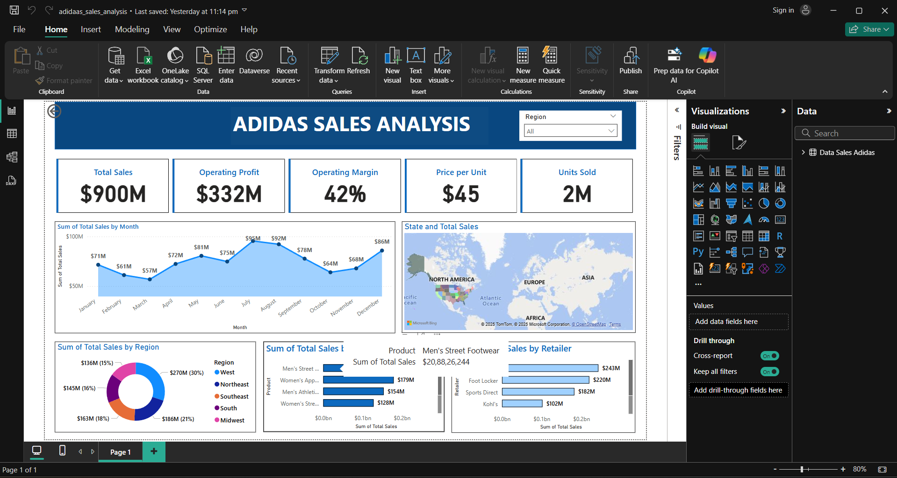

# 📊 Adidas Sales Analysis Dashboard

This project presents an interactive Power BI dashboard analyzing Adidas sales data across multiple dimensions, helping to uncover business insights and trends.

## ✅ Project Overview
- **Total Sales:** $900M analyzed
- **KPIs:** Operating Profit, Operating Margin, Price per Unit, Units Sold
- **Monthly Trends:** Sales trends over the year
- **Geospatial Analysis:** Sales by US states visualized on a map
- **Category Breakdown:** Sales by Region, Product category, and Retailer

The dashboard helps stakeholders:
- Identify high-performing products and regions
- Track monthly sales patterns
- Understand key metrics driving profitability

---

## 🛠 Tools & Technologies
- Power BI (visualization, DAX)
- Excel / CSV (data preparation)
- Data model: Star schema with fact and dimension tables

---

## 📸 Screenshots

---

## 📁 Files included
- `adidas_sales_analysis.pbix`: Power BI dashboard file
- `README.md`: Project description
- `dashboard_screenshot.png`: Image preview of the dashboard

---

## 🎯 Purpose
This project was created as part of a data visualization portfolio to showcase:
- Power BI skills
- Data storytelling and design
- Business insights extraction

---

## 📌 Usage
Download the `.pbix` file and open it in Power BI Desktop to explore the interactive dashboard.

---

## ✏ Author
- [dharanitharan](https://github.com/dharanitharan24)

